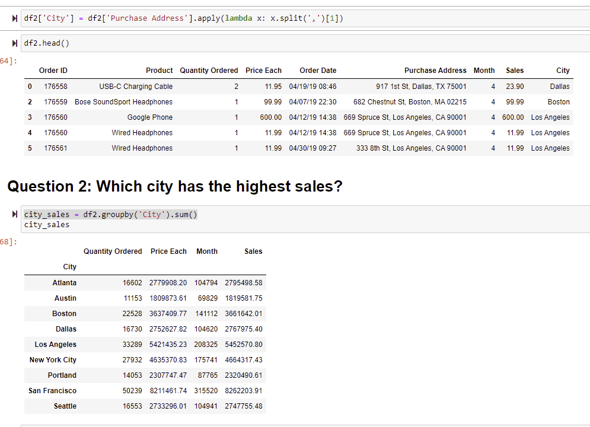
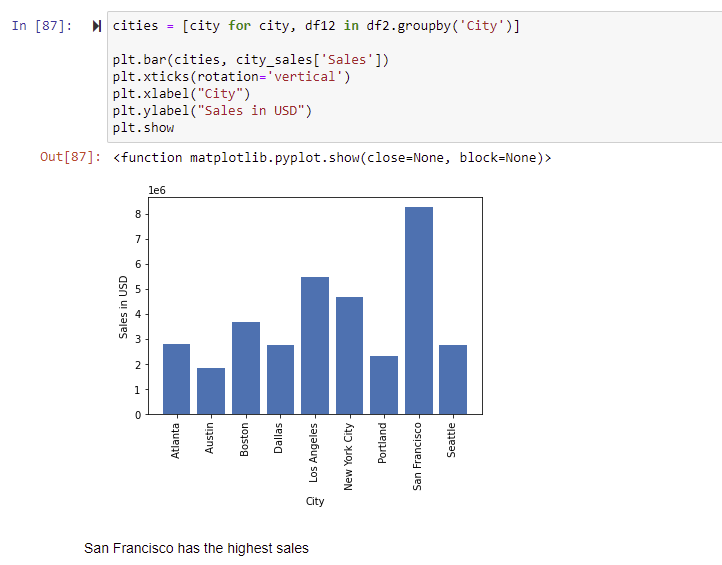
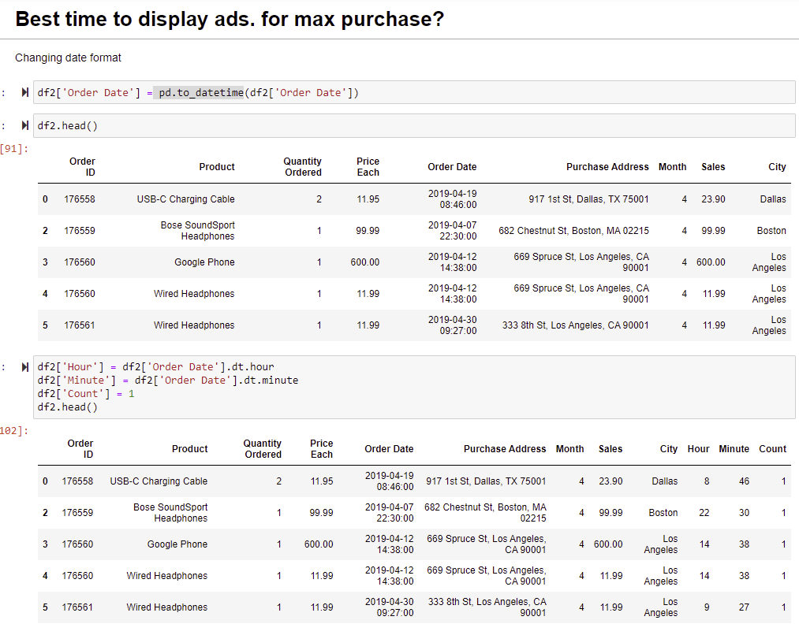
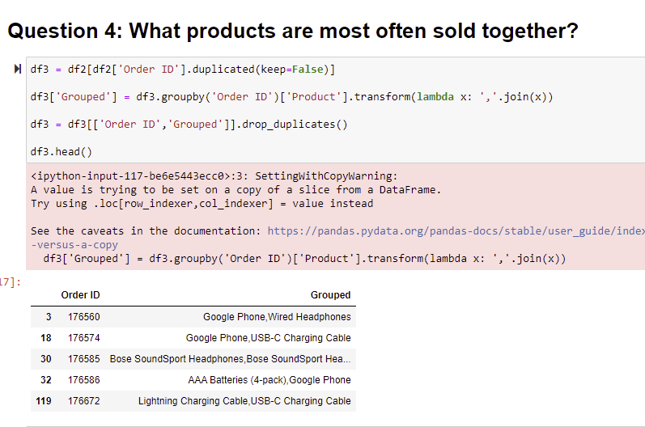
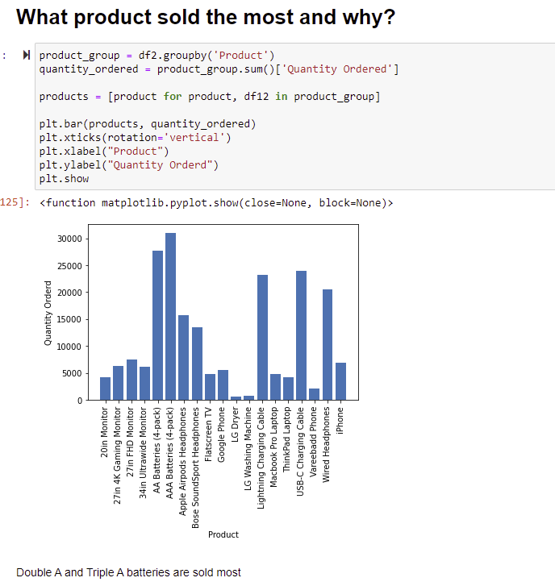
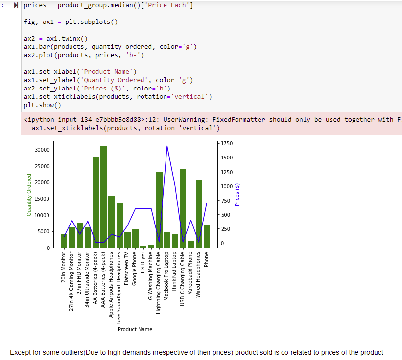

# Electronic_store_sales_data_analysis

In this project I've use Python Pandas & Python Matplotlib to analyze and answer business questions about 12 months worth of sales data and found a negative corelation between Product sale and purchase price. 
The data contains hundreds of thousands of electronics store purchases broken down by month, product type, cost, purchase address, etc. 

I've started by cleaning data. Tasks during this section include:
- Drop NaN values from DataFrame
- Removing rows based on a condition
- Change the type of columns (to_numeric, to_datetime, astype)

Once cleaned up the data in a desirable, I moved to data exploration section. In this section I explored 5 high level business questions related to the data:
- What was the best month for sales? How much was earned that month?
- What city sold the most product?
- What time should we display advertisemens to maximize the likelihood of customer’s buying product?
- What products are most often sold together?
- What product sold the most? Why do you think it sold the most?

To answer these questions let's walk through many different pandas & matplotlib methods. Which include but not limited to:
- Concatenating multiple csvs together to create a new DataFrame (pd.concat)
- Adding columns
- Parsing cells as strings to make new columns (.str)
- Using the .apply() method
- Using groupby to perform aggregate analysis
- Plotting bar charts and lines graphs to visualize our results
- Labeling our graphs

1) Merging all the monthly files of sales into one CSV file

2)Dealing with NAN
-This include check number of missing values in column
-Displaying NAN to check if it's safe to drop missing values(Not affect the analysis interpretation)
-Dropping missing values

3)Adding new column and tracking inaccurate entry from the column

4)Multipying two columns to get a sale info

5)Answering first question:
-What was the best month for sales? How much was earned that month?

6)Answering second question:
- What city sold the most product?
  - Extracting city name from address
  - Highest sale per city

7)Answering Third question:
- What time should we display advertisemens to maximize the likelihood of customer’s buying product?

8)Answering fourth question:
- What products are most often sold together?

9)Answering fivth question:
- What product sold the most? Why do you think it sold the most?

Proving hypothesis of price of product and sales of product are co-related

Hence, we can see the product sold is negatively co-related to product prices (Except for some outliers which have a great demand of use
